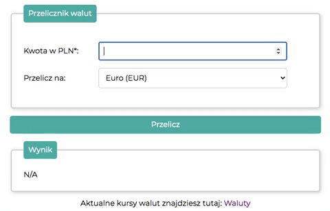
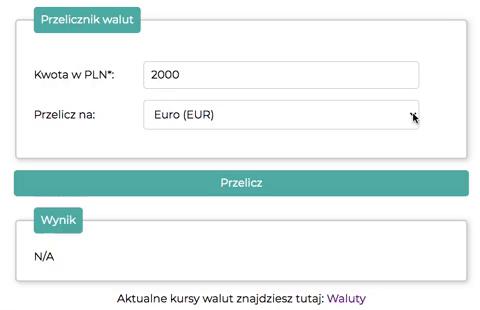
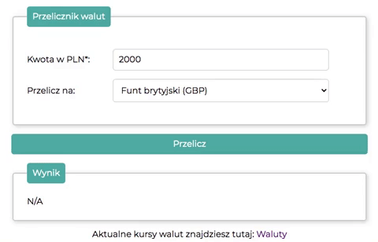

# Currency Converter App

## Preview of my Currency Converter App :leftwards_arrow_with_hook:
[Tap here!](https://tomasz-szczepanek.github.io/currency-converter/)

## General info

A simple application that converts PLN to EUR, USD, GBP and CHF.

## Used technologies

- HTML
- CSS
- BEM convention
- JavaScript

## Simple instruction

1. Enter the amount in the "Kwota w PLN" field

2. Select one of the available currencies in the "Przelicz na" field

3. Click on the "Przelicz" button

4. Now you can see the result in the field "Wynik"
